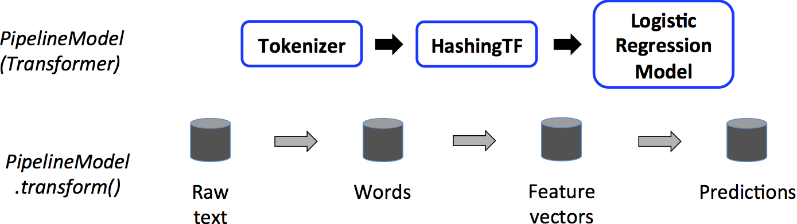

Transformer : DataFrame -> DataFrame 

Estimator : DataFrame -> Transformer (estimator.fit(dataFrame))

Pipeline : chains Transformers and Estimators

https://spark.apache.org/docs/latest/ml-pipeline.html

